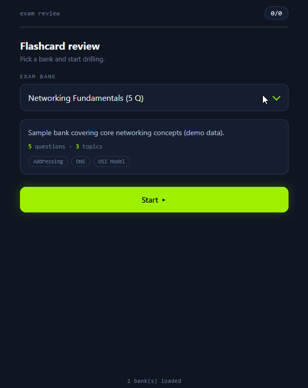

# Exam Review -- multi-course flashcard quiz

A HackTheBox-themed, offline MCQ flashcard player. Each course is a separate
JSON bank in `banks/`; a dropdown lets you pick which one to drill.



Two generic sample banks are included (`networking-fundamentals.json`,
`general-knowledge.json`) so you can open `index.html` and try the course
switcher immediately.

## Folder layout

```
exam-quiz/
  index.html            <- open this
  generate_index.py    <- rebuilds the index after you add/edit banks
  banks.js             <- generated (offline bundle)
  banks/
    manifest.json      <- generated (used when served over http)
    coae-final-review.json
    _template.json     <- copy this to start a new course (ignored by the menu)
```

## Add a new course

1. Copy `banks/_template.json` to `banks/my-course.json` and fill it in.
2. Run the index builder:

   ```bash
   python3 generate_index.py
   ```

3. Reload `index.html`. Your course appears in the dropdown.

Files starting with `_` or `.` are ignored, so `_template.json` never shows up.

## Bank format

Either a `{ "title", "description", "questions": [...] }` object or a bare list
of questions. Each question:

```json
{
  "topic": "Section name (groups the score breakdown)",
  "q": "The question text",
  "correct": "The correct option",
  "distractors": ["wrong 1", "wrong 2", "wrong 3"],
  "explain": "Shown after answering (optional)"
}
```

Key names are flexible: `q`/`question`, `correct`/`answer`,
`explain`/`explanation`. Each question needs exactly 3 distractors and 4 unique
options; `generate_index.py` warns and skips anything malformed.

## Running it

- **Offline (phone/desktop):** just open `index.html`. It loads `banks.js`
  (the generated bundle), so no server is needed. Re-run `generate_index.py`
  whenever a bank changes.
- **Served (optional):** `python3 -m http.server` then open
  `http://localhost:8000/index.html`. In this mode the page reads
  `banks/manifest.json` and fetches banks on demand -- handy if you host it,
  though you still run the generator to refresh the manifest.

## Controls

Answer with `A`-`D`, `Enter` for next, `S` to skip, `Q` to quit and score.
The report breaks the score down by topic and flags weak areas (`< review`).
